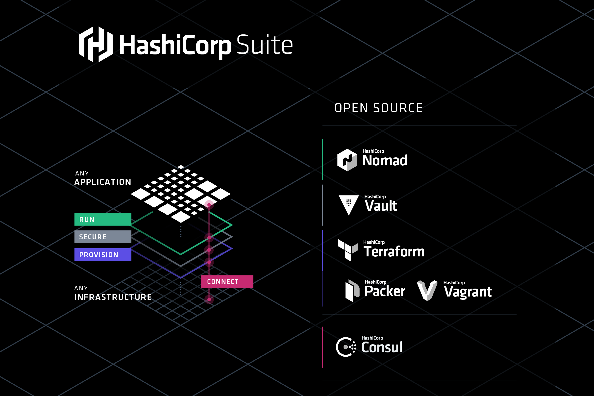
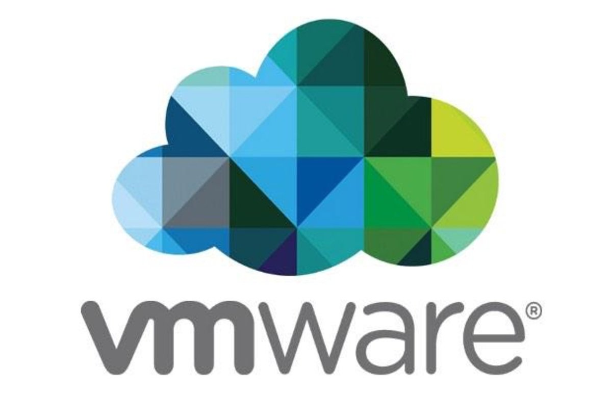
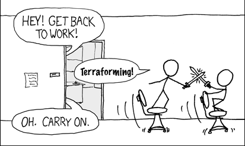

!SLIDE center title blue

# Terraforming PeopleSoft

!SLIDE center title orange

# Let's build training environments

~~~SECTION:notes~~~
What we want: 

1. PS training instances
1. build/teardown quickly
1. repeatable
1. controlled variations
1. A lot! (50 yesterday)
~~~ENDSECTION~~~

!SLIDE center title orange

# IN THE CLOUD!

~~~SECTION:notes~~~
Cheap, and we don't have room for them in the data center
~~~ENDSECTION~~~

!SLIDE center title white

!SLIDE center title black

!SLIDE center title purple

!SLIDE center title green

# Vagrant -> Workstation

!SLIDE center title green

# Terraform -> Infrastructure

!SLIDE center title white

!SLIDE center title white

!SLIDE center title white

!SLIDE center title white

!SLIDE center title white

!SLIDE center title purple

# Why Terraform? (and the cloud?)

~~~SECTION:notes~~~
How often do you need temporary servers, or training for a week, or projects that are cancelled and you don't need the servers?

~~~ENDSECTION~~~

!SLIDE center title oraclered

# The cloud has an API, Bob in IT does not

~~~SECTION:notes~~~
how soon can you get a new VM?
3 months?
1 month?
1 week?
Now, do your vm's talk to anything or each other

!SLIDE center title green

# Infrastructure as Code

~~~ENDSECTION~~~

!SLIDE center title blue

# DEMO

!SLIDE center title 

!SLIDE center title black

# With great cloud power comes great responsibility

~~~SECTION:notes~~~
Once you realize you have the power, it can lead to interesting discussions
~~~ENDSECTION~~~

!SLIDE center title green

# Kyle: Should we rebuild 50 servers? 

!SLIDE center title green

# Dan: Yeah, just destroy and rebuild.

!SLIDE center title green

# Kyle: Done. 
# (sips coffee)

!SLIDE center title black

# "Now I am become Death, the destroyer of Worlds" - Oppenheimer

!SLIDE center title oraclered

# "Now I am become Cloud Admin, the destroyer of Servers" - Kyle

!SLIDE center title white

!SLIDE center title white

!SLIDE center title blue

# How I can start terraforming?

!SLIDE center title blue

# ps-terraform - build PeopleSoft Images on AWS

!SLIDE center title black

# github.com/   psadmin-io/   ps-terraform

!SLIDE center title oraclered

# github.com/   oracle/   terraform-examples

!SLIDE center title blue

# QUESTIONS?

!SLIDE center title white

